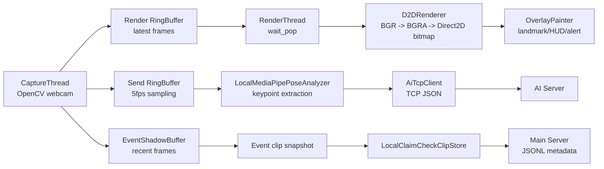

# StudySync Client

담당: 정태현  
기술 스택: C++17, MFC, OpenCV, Direct2D, WinHTTP, TCP socket

## 1. 현재 클라이언트 책임

StudySync Client는 웹캠 프레임을 실시간으로 표시하고, 자세/집중 분석 데이터를 서버로 전달하는 Windows 데스크톱 앱입니다.

핵심 책임은 다음처럼 분리합니다.

| 책임 | 주요 클래스 | 설명 |
|---|---|---|
| 웹캠 캡처 | `CaptureThread` | OpenCV로 프레임을 받아 렌더/AI/이벤트 버퍼로 분기 |
| 실시간 렌더링 | `RenderThread`, `D2DRenderer`, `OverlayPainter` | Direct2D로 화면과 HUD 오버레이 출력 |
| 로컬 자세 특징 추출 | `LocalMediaPipePoseAnalyzer` | 현재는 OpenCV Haar 기반 placeholder, 추후 MediaPipe 교체 예정 |
| AI 서버 통신 | `AiTcpClient` | 5fps 샘플링 프레임에서 추출한 keypoint JSON을 TCP로 전송 |
| 메인서버 로그 전송 | `JsonlBatchUploader`, `HttpJsonlLogSink` | 분석/이벤트 로그를 NDJSON(JSONL) 형태로 HTTP 업로드 |
| 이벤트 클립 관리 | `EventShadowBuffer`, `LocalClaimCheckClipStore` | 이벤트 전후 프레임을 로컬 클립으로 저장하고 경로/메타데이터만 전송 |
| 알림/HUD | `AlertManager`, `AlertDispatchThread`, `ToastBuffer` | 자세 경고, 휴식 권장, 토스트 메시지 표시 |
| 서버 통계 조회 | `StatsApi`, `ServerStatsSnapshot` | `/stats/today` 결과를 백그라운드에서 가져와 HUD에 표시 |

## 2. 프레임 파이프라인



렌더링은 AI 서버 응답을 기다리지 않습니다. AI가 늦거나 끊겨도 화면은 `RenderThread`가 최신 프레임을 계속 그립니다.

## 3. AI 서버 통신 기준

현재 AI 서버에는 JPEG/base64 영상을 보내지 않습니다.

클라이언트가 프레임에서 자세 특징값을 먼저 추출하고, 그 결과만 TCP JSON으로 전송합니다.

전송 필드:

```json
{
  "protocol_no": 2000,
  "session_id": 1,
  "frame_id": 120,
  "timestamp_ms": 1710000000000,
  "ear": 0.31,
  "neck_angle": 18.2,
  "shoulder_diff": 4.1,
  "head_yaw": 2.4,
  "head_pitch": 11.8,
  "face_detected": true
}
```

`phone_detected`는 현재 클라이언트 범위에서 사용하지 않습니다. 휴대폰 감지는 붙이지 않는 방향으로 고정합니다.

## 4. 메인서버 통신 기준

메인서버는 HTTP API를 사용합니다.

현재 클라이언트에서 사용하는 흐름:

| 목적 | 방식 | 설명 |
|---|---|---|
| 로그인/회원가입 | HTTP JSON | `AuthApi`, `TokenStore` |
| 세션 시작/종료 | HTTP JSON | `SessionApi` |
| 분석/이벤트 로그 | HTTP NDJSON | `JsonlBatchUploader` |
| 오늘 통계 조회 | HTTP GET | `StatsApi::today()` -> `/stats/today` |
| 이벤트 영상 | Claim Check | 로컬 클립 저장 후 메타데이터만 전송 |

통계 조회는 렌더링 스레드에서 직접 호출하지 않습니다. `WorkerThreadPool`에서 HTTP 요청을 보내고, 결과는 `ServerStatsSnapshot`에 캐싱합니다.

## 5. 설정 위치

기본 네트워크 설정은 `include/network/ClientTransportConfig.h`에서 관리합니다.

현재 기준:

| 항목 | 값 |
|---|---|
| 메인서버 URL | `http://10.10.10.130:8081` |
| AI 서버 | `10.10.10.50:9100` |
| 캡처 FPS | `30` |
| AI 샘플링 | `frame_sample_interval = 6` |
| 더미 AI | `use_dummy_ai = true` |

`frame_sample_interval = 6`은 30fps 기준 약 5fps 전송을 의미합니다.

## 6. 현재 구현 상태

| 항목 | 상태 |
|---|---|
| MFC 앱 기본 구조 | 구현 |
| OpenCV 캡처 | 구현 |
| Direct2D 렌더링 뼈대 | 구현 |
| HUD/토스트/세션 타이머 | 구현 |
| 더미 분석 결과 생성 | 구현 |
| AI TCP keypoint JSON 전송 뼈대 | 구현 |
| 메인서버 JSONL 업로드 | 구현 |
| `/stats/today` HUD 연결 | 초안 구현 |
| 실제 MediaPipe C++ 연동 | 미구현 |
| AI 서버 실제 학습 모델 연동 | 미구현 |
| 이벤트 클립 MP4 인코딩 | 미구현 또는 보강 필요 |

## 7. 다음 검증 질문

1. AI 서버에 원본 영상을 보내지 않는다면, 클라이언트의 keypoint 추출 품질이 전체 모델 정확도의 상한선이 됩니다. 현재 OpenCV placeholder를 언제 MediaPipe로 바꿀지 결정해야 합니다.
2. `/stats/today`는 HUD에 붙었지만 `/hourly`, `/weekly`, `/pattern`은 대시보드 화면이 만들어진 뒤 붙이는 것이 자연스럽습니다.
3. 이벤트 영상은 개인정보 이슈가 있으므로 메인서버에 직접 업로드하지 않고, 로컬 보관 기간과 삭제 정책을 먼저 확정해야 합니다.
