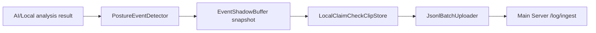

# AI 서버 TCP 프로토콜 초안

담당: 정태현(클라이언트), 정재훈(AI 서버)  
현재 결정: 클라이언트가 영상 원본이 아니라 자세 keypoint JSON을 TCP로 전송한다.

## 1. 설계 의도

처음에는 AI 서버에 JPEG 프레임을 보내는 구조도 고려했지만, 현재 방향은 클라이언트에서 1차 자세 특징값을 추출하고 AI 서버에는 가벼운 JSON만 보내는 방식입니다.

이 선택의 trade-off는 명확합니다.

| 선택 | 장점 | 단점 |
|---|---|---|
| 영상 전송 | AI 서버가 원본 기반으로 더 다양한 분석 가능 | 트래픽 증가, 개인정보 부담, 서버 GPU/CPU 병목 증가 |
| keypoint JSON 전송 | 트래픽 감소, 개인정보 노출 감소, 서버 확장 쉬움 | 클라이언트 keypoint 품질이 전체 정확도를 제한 |

현재 StudySync Client는 keypoint JSON 방식을 기준으로 구현합니다.

## 2. 연결 정보

| 항목 | 값 |
|---|---|
| 프로토콜 | TCP |
| AI 서버 호스트 | `10.10.10.50` |
| 포트 | `9100` |
| 전송 주기 | 30fps 캡처 기준 6프레임마다 1회, 약 5fps |
| 메시지 형식 | 4바이트 big-endian 길이 헤더 + UTF-8 JSON |

패킷 구조:

```text
[uint32 json_length_big_endian][json_payload]
```

현재 Stage 1에서는 JSON 뒤에 JPEG/binary payload를 붙이지 않습니다.

## 3. 클라이언트 -> AI 서버

### Protocol 2000: `KEYPOINT_PUSH`

클라이언트가 추출한 자세 특징값을 AI 서버에 전달합니다.

```json
{
  "protocol_no": 2000,
  "session_id": 12,
  "frame_id": 300,
  "timestamp_ms": 1710000000000,
  "ear": 0.31,
  "neck_angle": 18.2,
  "shoulder_diff": 4.1,
  "head_yaw": 2.4,
  "head_pitch": 11.8,
  "face_detected": true
}
```

필드 설명:

| 필드 | 타입 | 설명 |
|---|---|---|
| `protocol_no` | int | `2000` |
| `session_id` | int64 | 현재 학습 세션 ID |
| `frame_id` | uint64 | 클라이언트 내부 프레임 증가값 |
| `timestamp_ms` | uint64 | 프레임 캡처 시각 |
| `ear` | double | 눈 감김 판단용 Eye Aspect Ratio |
| `neck_angle` | double | 목 기울기 추정값 |
| `shoulder_diff` | double | 어깨 수평 차이 추정값 |
| `head_yaw` | double | 고개 좌우 회전 추정값 |
| `head_pitch` | double | 고개 상하 기울기 추정값 |
| `face_detected` | bool | 얼굴 검출 성공 여부 |

`phone_detected`는 보내지 않습니다. 휴대폰 감지는 현재 클라이언트 범위에서 제외합니다.

## 4. AI 서버 -> 클라이언트

### Protocol 2001: `ANALYSIS_RES`

AI 서버가 집중/졸음/부재/자세 상태를 반환합니다.

권장 응답:

```json
{
  "protocol_no": 2001,
  "session_id": 12,
  "frame_id": 300,
  "timestamp_ms": 1710000000000,
  "confidence": 0.91,
  "focus_score": 84,
  "state": "focus",
  "posture_ok": true,
  "is_drowsy": false,
  "is_absent": false,
  "guide": "정상 자세입니다."
}
```

클라이언트는 이 결과를 `AnalysisResultBuffer`에 저장하고, `OverlayPainter`가 최신 결과를 HUD에 반영합니다.

## 5. 이벤트 처리 연결

AI 서버가 위험 상태를 판단하거나 클라이언트 로컬 감지기가 이벤트를 판단하면 다음 흐름을 탑니다.



이벤트 영상 자체를 TCP에 실어 보내지 않습니다. 로컬에 저장하고, 메인서버에는 이벤트 종류, 시간, 소유자, 로컬 참조 경로 같은 메타데이터만 JSONL로 전송합니다.

## 6. 현재 구현 기준

| 항목 | 상태 |
|---|---|
| TCP 연결 뼈대 | 구현 |
| keypoint JSON 송신 | 구현 |
| AI 응답 JSON 파싱 | 초안 구현 |
| JPEG/binary 전송 | 사용하지 않음 |
| phone 감지 | 사용하지 않음 |
| 실제 MediaPipe 연동 | 미구현 |
| 현재 로컬 분석기 | OpenCV Haar 기반 placeholder |

## 7. 검증 질문

1. AI 서버가 원본 영상 없이 keypoint만 받아도 목표 정확도를 낼 수 있는가?
2. 클라이언트의 MediaPipe 추출 실패율이 높을 때 AI 서버는 어떤 fallback state를 반환할 것인가?
3. `timestamp_ms` 기준으로 이벤트 클립을 자를 때, 클라이언트와 AI 서버의 시간 기준을 얼마나 엄격하게 맞출 것인가?
