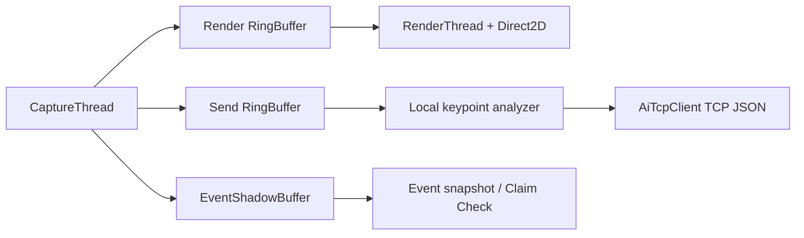

# StudySync Client 구현 진행 현황

작성일: 2026-05-07  
브랜치: `feature/taehyun`  
작성자: 정태현(클라이언트)

## 1. 진행 요약

| 영역 | 상태 | 비고 |
|---|---|---|
| MFC 프로젝트 구조 | 완료 | `CWinApp`, `CMainFrame`, `CStudySyncClientView` |
| OpenCV 웹캠 캡처 | 구현 | `CaptureThread` |
| 렌더링 파이프라인 | 구현 | `RenderThread`, `D2DRenderer`, `OverlayPainter` |
| HUD/토스트/세션 타이머 | 구현 | Direct2D 오버레이 |
| 로그인/회원가입 UI | 구현 | `LoginDlg`, `RegisterDlg` |
| 메인서버 HTTP 연동 | 구현 | Auth, Session, Log ingest |
| JSONL 로그 전송 | 구현 | 10초 주기 batch flush |
| Dummy AI | 구현 | AI 서버 준비 전 테스트용 |
| AI 서버 TCP 통신 | 초안 구현 | keypoint JSON 송수신 뼈대 |
| `/stats/today` HUD 연결 | 초안 구현 | `StatsApi`, `ServerStatsSnapshot` |
| 실제 MediaPipe 연동 | 미구현 | 현재 OpenCV Haar placeholder |
| 이벤트 클립 MP4 저장 | 보강 필요 | Claim Check 구조는 있음 |
| 목표 설정/통계 대시보드 화면 | 미구현 | 메인서버 API 준비 후 연결 |

## 2. 현재 프레임 흐름

렌더링은 AI 응답과 분리되어 있습니다. AI 서버가 늦어도 클라이언트 화면은 최신 웹캠 프레임 기준으로 계속 출력됩니다.

## 3. AI 서버 통신 변경점

예전 설계에는 JPEG 프레임 전송 설명이 남아 있었지만, 현재 구현 기준은 다음과 같습니다.

| 항목 | 현재 기준 |
|---|---|
| 프로토콜 | TCP |
| 포트 | `10.10.10.50:9100` |
| 패킷 | 4바이트 big-endian JSON 길이 + JSON |
| payload | keypoint JSON |
| JPEG/binary | 사용하지 않음 |
| `phone_detected` | 사용하지 않음 |

AI 서버로 보내는 값은 `ear`, `neck_angle`, `shoulder_diff`, `head_yaw`, `head_pitch`, `face_detected`입니다.

## 4. 메인서버 연동 상태

| 기능 | 상태 |
|---|---|
| `/auth/register` | 연결 |
| `/auth/login` | 연결 |
| `/session/start` | 연결 |
| `/session/end` | 연결 |
| `/log/ingest` analysis batch | 연결 |
| `/log/ingest` event metadata | 연결 |
| `/stats/today` | HUD 초안 연결 |
| `/stats/hourly` | 미연결 |
| `/stats/weekly` | 미연결 |
| `/stats/pattern` | 미연결 |

`/stats/today`는 렌더 스레드가 직접 호출하지 않고, `WorkerThreadPool`에서 가져온 뒤 `ServerStatsSnapshot`에 저장합니다.

## 5. 현재 책임 분리

| 객체 | 책임 |
|---|---|
| `CaptureThread` | 카메라 프레임 획득과 버퍼 분기 |
| `RingBuffer` | 렌더/전송용 최신 프레임 보관 |
| `EventShadowBuffer` | 이벤트 전후 클립 추출용 최근 프레임 보관 |
| `D2DRenderer` | Direct2D bitmap 업로드와 화면 출력 |
| `OverlayPainter` | HUD, 자세 상태, 알림, 통계 표시 |
| `AiTcpClient` | AI 서버 TCP keypoint 송수신 |
| `JsonlBatchUploader` | 메인서버 NDJSON 로그 전송 |
| `StatsApi` | 메인서버 통계 API 조회 |
| `ServerStatsSnapshot` | 서버 통계 캐시 |
| `AlertManager` | 자세/졸음/휴식 알림 판단 |

## 6. 다음 구현 우선순위

1. 실제 MediaPipe C++ 연동 또는 Python/AI 서버와의 keypoint 책임 재조정
2. AI 서버 `ANALYSIS_RES` 응답 스키마 확정
3. 이벤트 클립 저장 포맷 확정: JPEG sequence, MP4, ZIP 중 선택
4. `/stats/hourly`, `/stats/weekly`, `/stats/pattern` 대시보드 화면 연결
5. 목표 설정 UI와 `/goal` API 연결
6. 401 토큰 만료 처리와 자동 로그아웃/재로그인 UX

## 7. 검증 질문

1. AI 서버에 영상이 아니라 keypoint만 보내는 선택이 팀의 AI 학습 방향과 맞는가?
2. 개인정보 보호를 위해 이벤트 클립을 로컬 3일 보관으로 제한하는 정책을 메인서버 담당자와 합의했는가?
3. 실서비스 기준으로는 `use_dummy_ai=false` 전환 시점을 언제로 잡을 것인가?
