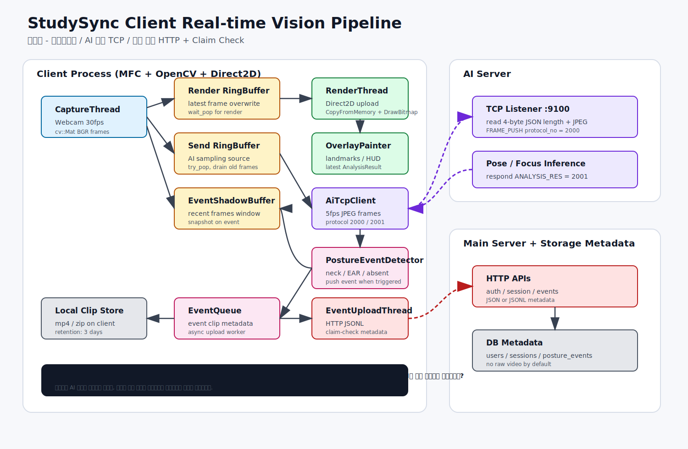

# StudySync Client Pipeline - TCP AI Server Version

작성자: 정태현 - 클라이언트



## 1. 한 줄 정의

클라이언트는 웹캠 영상을 실시간으로 렌더링하면서, AI 서버에는 최신 프레임만 TCP로 샘플링 전송하고, 이벤트가 발생하면 로컬 클립 저장 후 메인 서버에는 JSONL 메타데이터만 보내는 구조입니다.

## 2. 책임 분리

| 영역 | 책임 | 구현 뼈대 |
|---|---|---|
| Capture | 웹캠 프레임 획득, 버퍼 분배 | `CaptureThread` |
| Render | 화면 출력, Direct2D 업로드, 오버레이 표시 | `RenderThread`, `D2DRenderer`, `OverlayPainter` |
| AI TCP | 5fps 샘플링, JPEG 인코딩, AI 서버 TCP 송수신 | `AiTcpClient` |
| Event | 자세/졸음/이탈 이벤트 감지 | `PostureEventDetector`, `EventShadowBuffer` |
| Upload | 이벤트 메타데이터 전송, 로컬 클립 claim-check | `EventUploadThread`, `LocalClaimCheckClipStore` |
| Main Server | 로그인, 세션, 로그, 이벤트 메타데이터 관리 | HTTP API |

## 3. 클라이언트 내부 흐름

```text
CaptureThread
  ├─ Render RingBuffer
  │    └─ RenderThread
  │         └─ D2DRenderer
  │              └─ OverlayPainter
  ├─ Send RingBuffer
  │    └─ AiTcpClient
  │         ├─ TCP FRAME_PUSH 2000 → AI Server
  │         └─ TCP ANALYSIS_RES 2001 ← AI Server
  └─ EventShadowBuffer
       └─ event snapshot source
```

렌더링은 AI 응답을 기다리지 않습니다. AI 서버가 느리거나 끊겨도 화면 출력은 `Render RingBuffer`와 `Direct2D` 기준으로 계속 유지됩니다.

## 4. AI 서버 TCP 프로토콜

### 4.1 패킷 공통 구조

```text
[4-byte big-endian JSON length][JSON payload][optional binary payload]
```

- 4-byte header는 JSON 길이만 의미합니다.
- JPEG 크기는 JSON 내부의 `image_size`로 전달합니다.
- binary payload는 `FRAME_PUSH`에서만 사용합니다.

### 4.2 Client → AI: FRAME_PUSH

`protocol_no = 2000`

```json
{
  "protocol_no": 2000,
  "session_id": 1001,
  "timestamp_ms": 1746514205123,
  "timestamp": "2026-05-06T14:30:05+09:00",
  "image_format": "jpeg",
  "image_size": 15234
}
```

JSON 뒤에는 `image_size` 바이트만큼 JPEG 데이터가 이어집니다.

### 4.3 AI → Client: ANALYSIS_RES

`protocol_no = 2001`

```json
{
  "protocol_no": 2001,
  "session_id": 1001,
  "timestamp_ms": 1746514205123,
  "focus_score": 85,
  "state": "focus",
  "is_absent": false,
  "is_drowsy": false,
  "neck_angle": 12.3,
  "shoulder_diff": 5.1,
  "posture_ok": true,
  "ear": 0.35,
  "guide": "",
  "latency_ms": 45
}
```

클라이언트는 이 결과를 `AnalysisResultBuffer`에 저장해서 화면 오버레이에 쓰고, 동시에 `PostureEventDetector`에 넣어 이벤트 여부를 판단합니다.

## 5. 메인 서버 HTTP / JSONL 역할

AI 서버와의 프레임 통신은 TCP입니다. 메인 서버는 영상 추론 경로가 아니라 운영 데이터 경로입니다.

| 목적 | 방식 | 내용 |
|---|---|---|
| 로그인/회원가입 | HTTP JSON | 사용자 인증 |
| 세션 시작/종료 | HTTP JSON | 공부 세션 생성, 종료 통계 |
| 이벤트 로그 | HTTP JSONL | 자세 경고, 졸음, 이탈 이벤트 |
| 클립 참조 | Claim Check | 원본 영상 대신 로컬 저장 경로/메타데이터 전송 |

## 6. 이벤트 처리 흐름

```text
AI 분석 결과 수신
  → AnalysisResultBuffer 업데이트
  → PostureEventDetector.feed()
  → 이벤트 조건 충족
  → EventShadowBuffer.snapshot()
  → LocalClaimCheckClipStore 저장
  → EventQueue
  → EventUploadThread
  → Main Server HTTP JSONL
```

현재 기본 정책은 개인정보 보호를 고려해 원본 영상은 클라이언트 로컬에 보관하고, 메인 서버에는 이벤트 메타데이터만 보냅니다.

## 7. 팀원 검증 질문

AI 서버 담당자는 아래를 먼저 맞추면 됩니다.

1. AI 서버가 `10.10.10.50:9100`에서 TCP listen을 하는가?
2. 4-byte big-endian JSON length를 먼저 읽는가?
3. JSON의 `image_size`만큼 JPEG 바이트를 추가로 읽는가?
4. 같은 TCP 소켓으로 `protocol_no: 2001` 분석 결과 JSON을 응답하는가?

메인 서버 담당자는 아래를 맞추면 됩니다.

1. 클라이언트 로그인/세션 API를 HTTP로 받을 수 있는가?
2. 이벤트 로그를 JSONL 또는 JSON 배열로 받을 수 있는가?
3. `posture_events` 또는 동등한 이벤트 테이블이 있는가?
4. 원본 영상 저장 없이 claim-check 메타데이터만 받아도 되는가?

## 8. 현재 기준점

- AI 서버 통신: TCP
- 메인 서버 통신: HTTP JSON / JSONL
- 렌더링: Direct2D
- 캡처: OpenCV
- 이벤트 클립: 로컬 저장, 3일 보관 정책
- 실시간성 정책: 최신 프레임 우선, 오래된 AI 전송 프레임 drop
