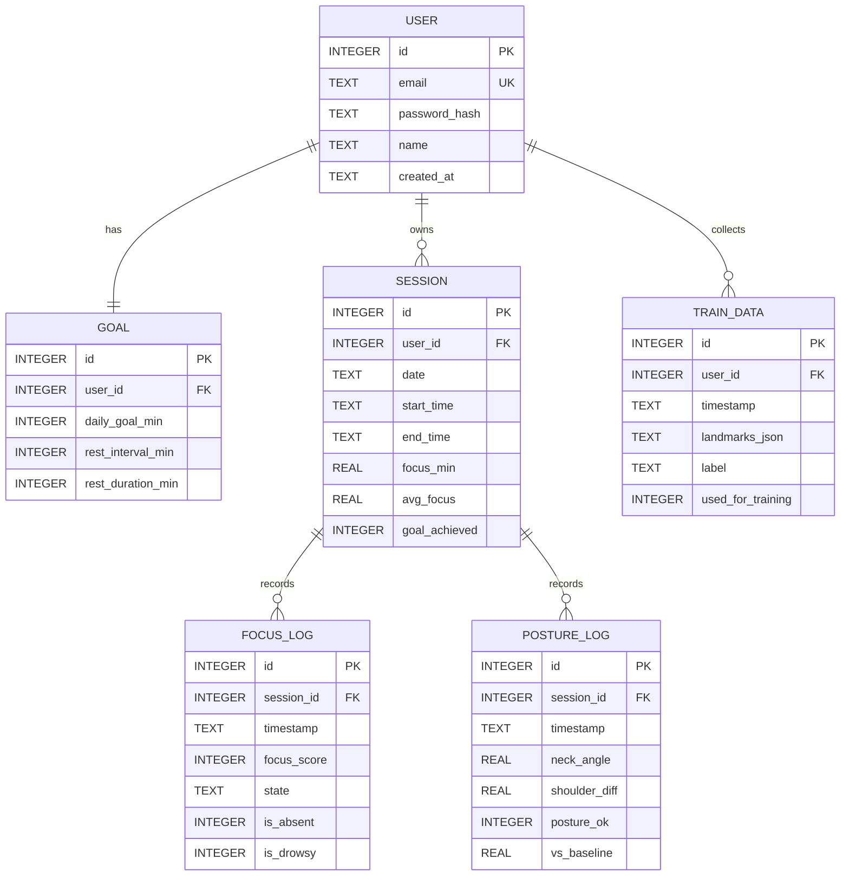

# [4조] StudySync DB ERD

## 1. 테이블 관계 요약

| 관계 | 종류 | 설명 |
|---|---|---|
| USER → GOAL | 1:1 | 사용자 1명당 목표 설정 1개 |
| USER → SESSION | 1:N | 사용자 1명이 여러 공부 세션 보유 |
| SESSION → FOCUS_LOG | 1:N | 세션 1개당 5초 단위 집중도 로그 다수 |
| SESSION → POSTURE_LOG | 1:N | 세션 1개당 자세 데이터 다수 |
| USER → TRAIN_DATA | 1:N | 사용자별 재학습 데이터 수집 |

## 2. ERD

## 3. 테이블 상세 정의

### USER

| 컬럼명 | 타입 | 제약조건 | 설명 |
|---|---|---|---|
| id | INTEGER | PK, AUTO | 사용자 고유 ID |
| email | TEXT | UNIQUE, NOT NULL | 로그인 이메일 |
| password_hash | TEXT | NOT NULL | bcrypt 해시 비밀번호 |
| name | TEXT | NOT NULL | 사용자 이름 |
| created_at | TEXT | DEFAULT NOW | 가입 일시 |

### GOAL

| 컬럼명 | 타입 | 제약조건 | 설명 |
|---|---|---|---|
| id | INTEGER | PK | 목표 ID |
| user_id | INTEGER | FK → USER.id | 사용자 참조 |
| daily_goal_min | INTEGER | DEFAULT 120 | 하루 목표 공부 시간(분) |
| rest_interval_min | INTEGER | DEFAULT 50 | 휴식 주기(분) |
| rest_duration_min | INTEGER | DEFAULT 10 | 휴식 시간(분) |

### SESSION

| 컬럼명 | 타입 | 제약조건 | 설명 |
|---|---|---|---|
| id | INTEGER | PK | 세션 ID |
| user_id | INTEGER | FK → USER.id | 사용자 참조 |
| date | TEXT | NOT NULL | 공부 날짜 |
| start_time | TEXT | NOT NULL | 세션 시작 시각 |
| end_time | TEXT | NULL 허용 | 세션 종료 시각 |
| focus_min | REAL | DEFAULT 0 | 실제 집중 시간(분) |
| avg_focus | REAL | DEFAULT 0 | 평균 집중도 점수 |
| goal_achieved | INTEGER | DEFAULT 0 | 목표 달성 여부 |

### FOCUS_LOG

| 컬럼명 | 타입 | 제약조건 | 설명 |
|---|---|---|---|
| id | INTEGER | PK | 로그 ID |
| session_id | INTEGER | FK → SESSION.id | 세션 참조 |
| timestamp | TEXT | NOT NULL | 기록 시각 |
| focus_score | INTEGER | 0~100 | 집중도 점수 |
| state | TEXT | NOT NULL | 집중/딴짓/졸음 |
| is_absent | INTEGER | DEFAULT 0 | 자리이탈 여부 |
| is_drowsy | INTEGER | DEFAULT 0 | 졸음 여부 |

### POSTURE_LOG

| 컬럼명 | 타입 | 제약조건 | 설명 |
|---|---|---|---|
| id | INTEGER | PK | 로그 ID |
| session_id | INTEGER | FK → SESSION.id | 세션 참조 |
| timestamp | TEXT | NOT NULL | 기록 시각 |
| neck_angle | REAL | NOT NULL | 목 각도 |
| shoulder_diff | REAL | NOT NULL | 어깨 기울기 차이 |
| posture_ok | INTEGER | DEFAULT 1 | 자세 정상 여부 |
| vs_baseline | REAL | DEFAULT 0 | 기준 자세 대비 변화량 |

### TRAIN_DATA

| 컬럼명 | 타입 | 제약조건 | 설명 |
|---|---|---|---|
| id | INTEGER | PK | 데이터 ID |
| user_id | INTEGER | FK → USER.id | 사용자 참조 |
| timestamp | TEXT | NOT NULL | 수집 시각 |
| landmarks_json | TEXT | NOT NULL | 33개 랜드마크 JSON |
| label | TEXT | NOT NULL | 집중/딴짓/졸음 |
| used_for_training | INTEGER | DEFAULT 0 | 학습 사용 여부 |

