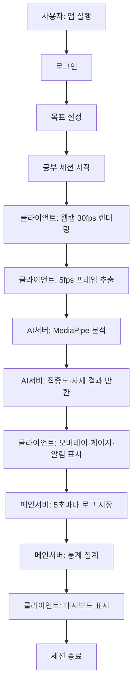
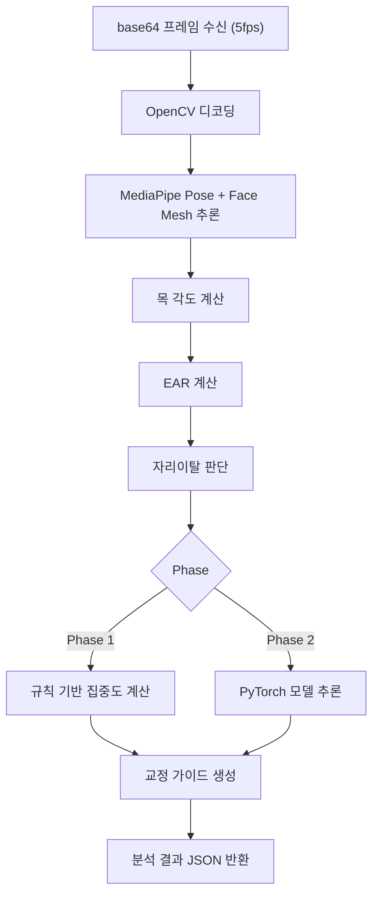
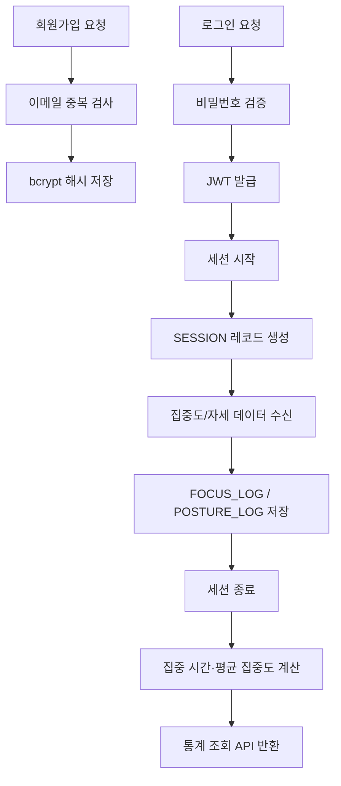
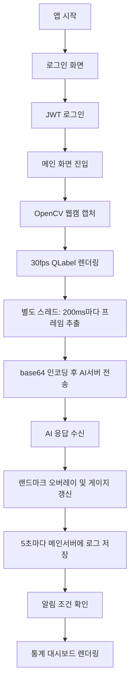

# [4조] StudySync 순서도

## 1. 전체 흐름

```mermaid
flowchart TD
    A["사용자: 앱 실행"] --> B["로그인"]
    B --> C["목표 설정"]
    C --> D["공부 세션 시작"]
    D --> E["클라이언트: 웹캠 30fps 렌더링"]
    E --> F["클라이언트: 5fps 프레임 추출"]
    F --> G["AI서버: MediaPipe 분석"]
    G --> H["AI서버: 집중도·자세 결과 반환"]
    H --> I["클라이언트: 오버레이·게이지·알림 표시"]
    I --> J["메인서버: 5초마다 로그 저장"]
    J --> K["메인서버: 통계 집계"]
    K --> L["클라이언트: 대시보드 표시"]
    L --> M["세션 종료"]
```

## 2. AI 서버 처리 흐름

```mermaid
flowchart TD
    A["base64 프레임 수신 (5fps)"] --> B["OpenCV 디코딩"]
    B --> C["MediaPipe Pose + Face Mesh 추론"]
    C --> D["목 각도 계산"]
    D --> E["EAR 계산"]
    E --> F["자리이탈 판단"]
    F --> G{"Phase"}
    G -->|Phase 1| H["규칙 기반 집중도 계산"]
    G -->|Phase 2| I["PyTorch 모델 추론"]
    H --> J["교정 가이드 생성"]
    I --> J
    J --> K["분석 결과 JSON 반환"]
```

## 3. 메인서버 처리 흐름

```mermaid
flowchart TD
    A["회원가입 요청"] --> B["이메일 중복 검사"]
    B --> C["bcrypt 해시 저장"]
    D["로그인 요청"] --> E["비밀번호 검증"]
    E --> F["JWT 발급"]
    F --> G["세션 시작"]
    G --> H["SESSION 레코드 생성"]
    H --> I["집중도/자세 데이터 수신"]
    I --> J["FOCUS_LOG / POSTURE_LOG 저장"]
    J --> K["세션 종료"]
    K --> L["집중 시간·평균 집중도 계산"]
    L --> M["통계 조회 API 반환"]
```

## 4. 클라이언트 처리 흐름

```mermaid
flowchart TD
    A["앱 시작"] --> B["로그인 화면"]
    B --> C["JWT 로그인"]
    C --> D["메인 화면 진입"]
    D --> E["OpenCV 웹캠 캡처"]
    E --> F["30fps QLabel 렌더링"]
    F --> G["별도 스레드: 200ms마다 프레임 추출"]
    G --> H["base64 인코딩 후 AI서버 전송"]
    H --> I["AI 응답 수신"]
    I --> J["랜드마크 오버레이 및 게이지 갱신"]
    J --> K["5초마다 메인서버에 로그 저장"]
    K --> L["알림 조건 확인"]
    L --> M["통계 대시보드 렌더링"]
```

